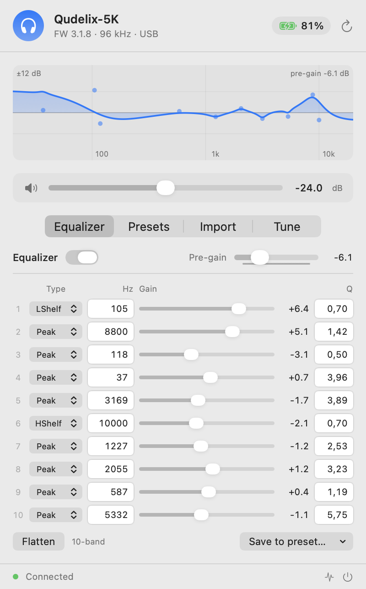
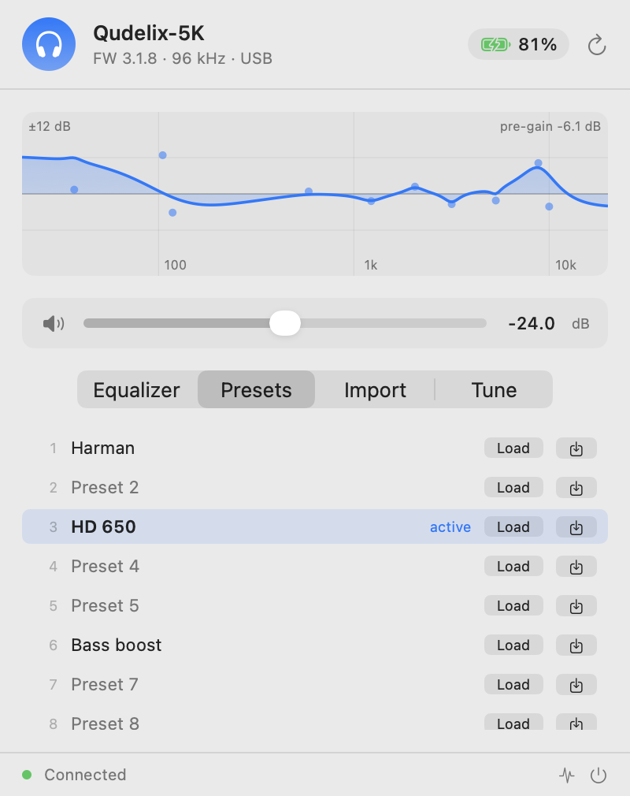
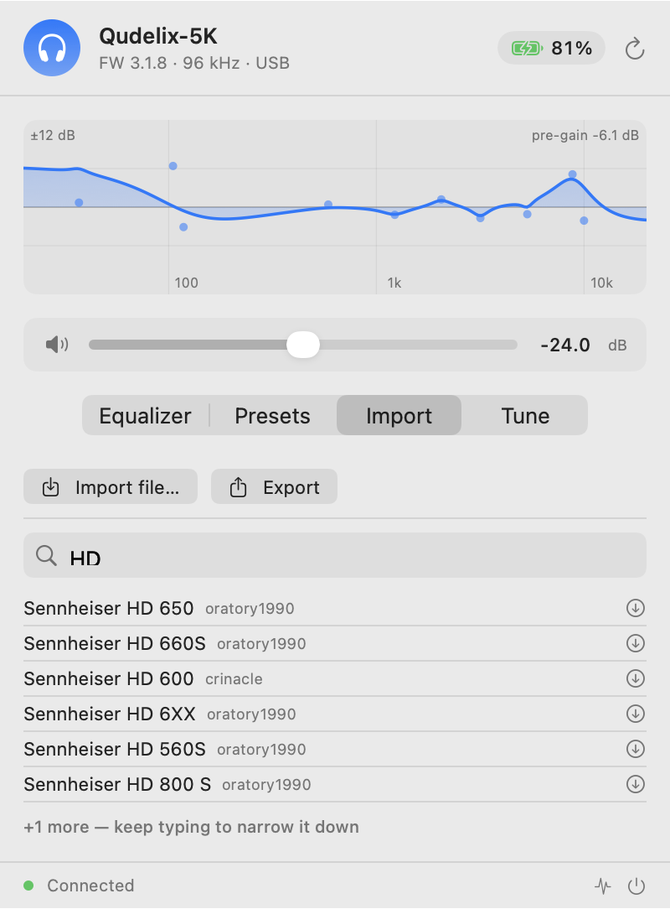

# Qudelix for macOS

A native macOS menu bar app for configuring the **Qudelix 5K** DAC/amp, over USB
or Bluetooth.

[](https://github.com/FrankieMa77/qudelix/releases/latest)
[](https://github.com/FrankieMa77/qudelix/releases)
[](https://github.com/FrankieMa77/qudelix/releases/latest)
[](https://github.com/FrankieMa77/qudelix/releases/latest)
[](LICENSE)

Unofficial, and not affiliated with or endorsed by Qudelix, Inc.

Qudelix ship a browser-based configuration app. On macOS it is unreliable —
Chrome's WebHID goes through the same system call that, if a report is framed
even one byte wrong, makes the 5K stop responding and drop off the USB bus. This
app talks to the device directly through IOKit instead, and gets the framing
right.

---

## Screenshots

| Equalizer | Presets | Import |
|---|---|---|
|  |  |  |

## Features

- **Live device status** — battery, charging, firmware, sample rate, input source
- **Volume** control with mute
- **10-band parametric EQ** editor: filter type, frequency, gain, Q, plus pre-gain
- **20-band mode** — follows whichever EQ mode the device is in
- **Live response curve** showing the combined filter shape
- **20 preset slots**, loaded and saved by name
- **Preset import** from a file, or from the
  [AutoEq](https://github.com/jaakkopasanen/AutoEq) database (6,000+ headphones)
- **Export** your EQ in the standard parametric format
- **Diagnostics panel** logging every packet exchanged with the device

Works over **USB or Bluetooth**. USB is used whenever the 5K is plugged in;
otherwise the app controls the device over Bluetooth LE. Either way it only
speaks to the 5K's control interface and never touches the audio path, so
playback is unaffected.

## Install

Download the `.dmg` from [Releases](../../releases), drag the app to
Applications, and launch it.

macOS will refuse to open it the first time — the app is signed only ad-hoc, not
with a paid Apple Developer ID. To allow it, open **System Settings → Privacy &
Security**, scroll to Security, and click **Open Anyway**. (The old
right-click → Open trick no longer works on current macOS.)

If you would rather not trust a binary, build it yourself — see below.

Requires macOS 14 or later. Universal binary, Apple Silicon and Intel.

### Verify your download

Because the app is signed ad-hoc, macOS cannot tell you who built it, and the
"Open Anyway" click above is pure trust. The checksum published with every
release is what narrows that gap. Before opening the DMG:

```
shasum -a 256 ~/Downloads/Qudelix-1.1.0.dmg
```

Compare the result against the SHA-256 in the [latest release
notes](../../releases/latest). Or, if you also downloaded the `.dmg.sha256`
file, let `shasum` do the comparison:

```
cd ~/Downloads && shasum -a 256 -c Qudelix-1.1.0.dmg.sha256
```

That should print `OK`. If the hashes differ, or the check fails, do not open
the file.

Be clear about what this does and does not buy you: it catches a corrupted
download or an asset replaced after publication, and it lets you confirm two
people downloaded the same bytes. It is not a substitute for notarization, and
it assumes the release page you read the hash from is itself genuine. Building
from source sidesteps all of it.

## Supported devices

The original **Qudelix 5K** on firmware 3.x, in either 10-band or 20-band EQ
mode.

The app identifies the device during its connection handshake, and if it finds
something it does not implement it says so and writes nothing, rather than
silently doing the wrong thing:

| Case | Why |
|---|---|
| 5K Plus, T71, Aura Vita | different EQ command set |
| Firmware 2.x | Qudelix changed the command format in firmware 3 |
| Firmware 1.x | too old; the official app refuses these too |

## Build from source

```sh
git clone https://github.com/FrankieMa77/qudelix.git
cd qudelix/QudelixBar
./build-app.sh              # current architecture, fast
./build-app.sh --universal  # arm64 + x86_64
./make-dmg.sh               # universal build, packaged as a DMG
```

Swift 5.9+ and the Xcode command line tools are all that is required; there are
no third-party dependencies.

## Privacy

- The only host contacted is `raw.githubusercontent.com`, and only to fetch the
  AutoEq headphone list and the preset you choose. This happens when you open
  the Import pane, never at launch.
- No telemetry, analytics, or crash reporting, and nothing is ever uploaded.
- One local file is written, `~/Library/Logs/QudelixBar.log`, holding device
  packet traces. It is never transmitted. Since it records raw packet hex it
  includes the 5K's own Bluetooth address and any preset names stored on it, so
  it is worth a glance before attaching it to a bug report.
- Bluetooth scanning never records the names of other devices nearby, only a
  count of how many were ignored.
- Only EQ, volume, and preset settings are written to the device — the same
  things the official app writes. Firmware is never touched.

## Developer tools

`Sources/qxusb` and `Sources/qxprobe` are diagnostic CLIs, not part of the app.
They can destabilise a device if misused — `qxusb --noid` deliberately
reproduces a USB bus-drop failure, and `qxprobe` sends Bluetooth GAIA commands.
Read the source before running them.

## Known limitations

- Only the user (headphone) EQ group is exposed, not the speaker group.
- Preset slots show generic names unless you have named them on the device.
- 20-band mode is implemented from Qudelix's preset format but has not been
  tested on real hardware. Writing should behave exactly as 10-band does; if a
  20-band curve reads back wrong, the app keeps flat defaults rather than
  showing nonsense. Reports welcome.
- No auto-update mechanism yet.

## Feedback and contributions

Bug reports, ideas, and pull requests are all welcome — open an
[issue](../../issues) or a PR.

Especially useful right now:

- **20-band EQ mode** is implemented but has never run on real hardware. If you
  use it, tell me whether your curve reads back correctly.
- **Firmware other than 3.1.8**, or any 5K that behaves oddly — the diagnostics
  panel and `~/Library/Logs/QudelixBar.log` capture everything needed.
- **Intel Macs.** The binary is universal but has only been run on Apple Silicon.

## Licence

[MIT](LICENSE). Use it, build it, fork it; no warranty is given.

## Credits

- [devicePEQ](https://github.com/jeromeof/devicePEQ) — prior open-source work on
  the Qudelix HID protocol
- [AutoEq](https://github.com/jaakkopasanen/AutoEq) by Jaakko Pasanen — the
  headphone correction database
